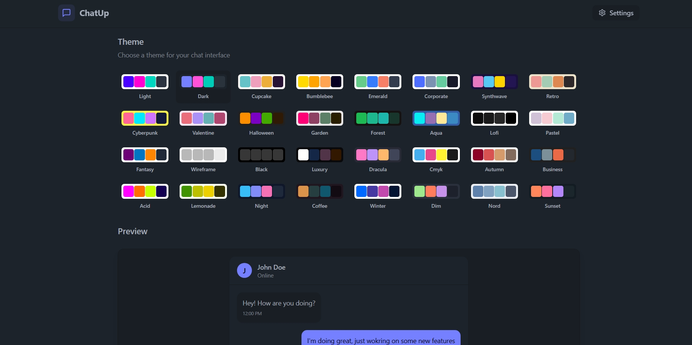

# 💬 ChatUp : Realtime Chatting Application [(Live Link)](https://chat-app-fullstack-tan.vercel.app/)
A real-time chat application built using the MERN stack (MongoDB, Express.js, React, Node.js) with socket.io for seamless communication. This app allows users to register, log in, create private or group chats, and communicate in real-time.

<!-- [](https://www.youtube.com/watch?v=ntKkVrQqBYY) -->

---

## 🚀 Features

- 💬 Real-time messaging using **Socket.io**
- 🔐 JWT-based **Authentication & Authorization**
- 👥 **One-on-One** and **Group Chats**
- 🔍 User Search to start conversations
- 📱 Fully responsive UI
- 🌙 30+ Theme to choose from including Light/Dark 

---

## 🖼️ Screenshots

### 🔐 Login Page


### 💬 Chat Interface


### 💬 Theme Options Setting


<!-- ### 📱 Mobile Responsive View
 -->


---

## 🛠️ Tech Stack

**Frontend:**
- React.js
- Axios
- React Context API
- Dasiy UI / Tailwind CSS

**Backend:**
- Node.js
- Express.js
- MongoDB + Mongoose
- Socket.io
- JSON Web Token (JWT)
- Bcrypt
- Cloudinary

---

## ⚙️ Getting Started

### Prerequisites
- Node.js
- MongoDB
- npm or yarn

### 🔧 Installation

#### 1. Clone the repository
```bash
git clone https://github.com/aazaadcoder/chatUp.git
cd chatUp
```

#### 2. Set up the backend
```bash
cd backend
npm install
# Create a .env file (refer to .env.example)
npm run dev
```

#### 3. Set up the frontend
```bash
cd ../frontend
npm install
npm run dev
```

### 📝 Environment Variables

Create a `.env` file in the backend directory:

```
MONGODB_URI = 
PORT = 5001
JWT_SECRET = 
NODE_ENV = development
CLOUDINARY_CLOUD_NAME =
CLOUDINARY_API_KEY = 
CLOUDINARY_API_SECRET =
```

---

## 📁 Folder Structure

<!-- ```
mern-chat-app/
├── backend/
│   ├── controllers/
│   ├── models/
│   ├── routes/
│   ├── config/
│   ├── middleware/
│   ├── .env
│   └── server.js
├── frontend/
│   ├── src/
│   │   ├── components/
│   │   ├── context/
│   │   ├── pages/
│   │   ├── utils/
│   │   └── App.js
│   └── public/
└── README.md
``` -->
<!-- 
---

## 🌐 Deployment

You can deploy this app using:
* **Frontend** – Vercel / Netlify
* **Backend** – Render / Railway / Cyclic / Heroku
* **Database** – MongoDB Atlas

### Deployment Steps

1. **Database**: Set up a MongoDB Atlas cluster
2. **Backend**: Deploy to Render/Railway with environment variables set
3. **Frontend**: Deploy to Vercel/Netlify with the backend URL configured

--- -->

<!-- ## 📹 Demo

🎥 [Watch Demo on YouTube](https://www.youtube.com/watch?v=ntKkVrQqBYY)

## 🧪 API Endpoints

### Auth Routes
- `POST /api/user/register` - Register a new user
- `POST /api/user/login` - Login a user
- `GET /api/user` - Get user profile (protected)

### Chat Routes
- `GET /api/chat` - Get all chats for a user
- `POST /api/chat` - Create a one-on-one chat
- `POST /api/chat/group` - Create a group chat
- `PUT /api/chat/group` - Update a group chat
- `GET /api/chat/:chatId` - Get a specific chat with messages

### Message Routes
- `GET /api/message/:chatId` - Get all messages for a chat
- `POST /api/message` - Send a message

--- -->

## 🛠️ Future Improvements

- File sharing
- Message reactions and replies
- Voice and video calls
- Read receipts
- Enhanced group chat features
- Push notifications

<!-- ---

## 🙌 Acknowledgements


--- -->

## 📬 Contact

Made with ❤️ by **Harshit Negi**
- 📧 Email: harshitnegipro@gmail.com
- 🔗 LinkedIn: [https://www.linkedin.com/in/negiharshit/](https://www.linkedin.com/in/negiharshit/)
- 🐙 GitHub: [https://github.com/aazaadcoder](https://github.com/aazaadcoder)

---

<!-- ## 📄 License

This project is licensed under the MIT License - see the [LICENSE](LICENSE) file for details. -->